# SERVIDOR WEB Apache 2
* https://despliegue.codeandcoke.com/apuntes:servidores_web
* http://jamj2000.github.io/despliegueaplicacionesweb/2/diapositivas#/2
* https://despliegue.abrilcode.com/doku.php?id=bloque3:web
* https://plataforma.josedomingo.org/pledin/cursos/apache24/index.html

# 1.- Infraestructura
Reutilizaremos las MV de la práctica de **ssh**. Dos MV dentro de una **red NAT**:
* **Servidor**: con un Ubuntu server sin entorno gráfico.
    * Usuario: **sergio**, contraseña: **sergio**.
* **Casa**: con un Lubuntu con el entorno gráfico por defecto (LXQt).
    * Usuario: **carmen**, contraseña: **carmen**.

Desde el equipo **Casa** nos conectaremos al equipo **Servidor** mediante una conexión **ssh** autentificándonos
mediante claves asimétricas **ed25519**.

# 2.- Instalación y uso básico
1. Acceder al servidor:
```bash
ssh -i ~/.ssh/id_ed25519 10.0.2.4
```
> Casi toda la instalación y configuración la debemos hacer con privilegios de administrador
podemos ejecutar **sudo** en todas las instrucciones o cambiar al usuario administrador **sudo su**.


2. Instalar Apache y ver versión:
```bash
sudo apt update
sudo apt install apache2
apache2 -v
```
>La instalación crea el usuario **www-data** que ejecuta el servicio denominado **apache2**. Puedes
comprobar el usuario mostrando el contenido del archivo **cat /etc/passwd | grep wwwdata**
y ver el proceso en ejecución con: **ps -aux | grep www-data**

3. Comprobar estado del servicio **apache2**:
```bash
sudo systemctl status apache2
```
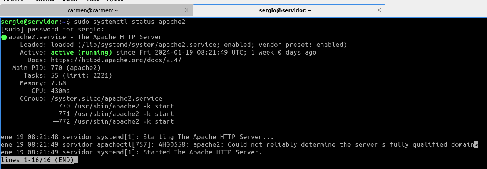


4. Con los siguientes comandos lo activaremos para que se inicie al arrancar el servidor y lo iniciaremos:
```bash
sudo systemctl enable apache2
sudo systemctl start apache2
```
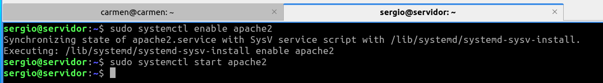

>Otras comandos del servicio son:
>```bash
>sudo systemctl [enable|start|restart|status|reload|show|disable] apache2
>```
5. Apache trae un funcionalidad para gestionar el servicio: **apache2ctl**.
```bash
apache2ctl [-k start|restart|graceful|graceful-stop|stop]
```
Por ejemplo:
```bash
sudo apache2ctl -h

sudo apache2ctl -M
```
Esta herramienta también nos ofrece información del servidor:
* **apache2ctl -t**: Comprueba la sintaxis del fichero de configuración.
* **apache2ctl -M**: Lista los módulos cargados.
* **apache2ctl -S**: Lista los sitios virtuales y las opciones de configuración.
* **apache2ctl -V**: Lista las opciones de compilación

6. Reglas firewall:
```bash
sudo ufw enable
sudo ufw allow Apache
sudo ufw status verbose
```
> También puedes añadir la regla con: **sudo ufw allow 80/tcp**.

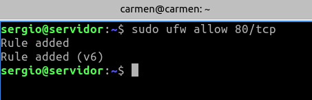

7. Probar desde el cliente qué puertos tiene abiertos el servidor, en nuestro ejemplo desde el equipo
**Casa** ejecutaremos:
```bash
nmap 10.0.2.4 -p 1-1024
```
>Por defecto el servicio HTTP utiliza el puerto 80.

>Si no tienes instalada esta utilidad, instalalá con: **sudo apt install nmap**. Esta
comprobación también se puede hacer desde el propio servidor, pero es menos fiable que
desde otro equipo ya que puede conectarse por la interfaz de loopback.

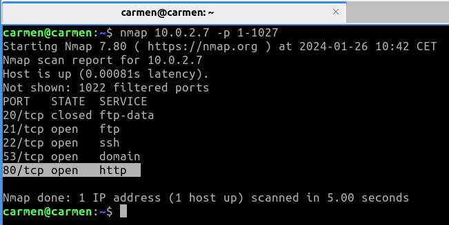


8. Comprobar en el equipo **Servidor** qué conexiones tiene abiertas:
```bash
sudo ss -natu

o

sudo ss -natup | grep apache2
```

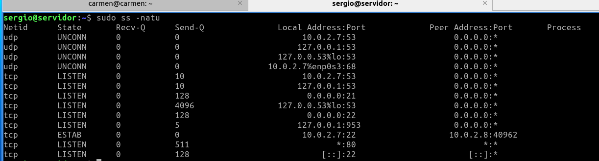


# 3.- Archivos de configuración
1. Los archivos de configuración de **apache2** se encuentran en la carpeta **/etc/apache2/**.
```bash
/etc/apache2
├── apache2.conf
├── conf-available
│ ├── ...
├── conf-enabled
│ ├── ...
├── envvars
├── magic
├── mods-available
│ ├── ...
├── mods-enabled
│ ├── ...
├── ports.conf
├── sites-available
│ ├── 000-default.conf
│ └── default-ssl.conf
└── sites-enabled
└── 000-default.conf -> ../sites-available/000-default.conf
```
* **apache2.conf**: El fichero de configuración principal de Apache, donde se pueden realizar
cambios generales
* **envvars**: Contiene la configuración de las variables de entorno
* **ports.conf**: Contiene la configuración de los puertos donde Apache escucha
* **conf-available**: Contiene ficheros de configuración adicionales para diferentes aspectos de
Apache o de aplicaciones web como phpMyAdmin
* **conf-enabled**: Contiene una serie de enlaces simbólicos a los ficheros de configuración
adicionales para activarlos. Puede activarse o desactivarse con los comandos **a2enconf** o
**a2disconf**
* **mods-available**: Contiene los módulos disponibles para usar con Apache
* **mods-enabled**: Contiene enlaces simbólicos a aquellos módulos de Apache que se
encuentran activados en este momento. Se crean utilizando los comandos **a2enmod** y
**a2dismod** que más adelante explicaremos con más detalle
* **sites-available**: Contiene los ficheros de configuración de cada uno de los hosts virtuales
configurados y disponibles (activos o no).
* **sites-enabled**: Contiene una serie de enlaces simbólicos a los ficheros de configuración
cuyos hosts virtuales se encuentran activos en este momento. Se crean a través de los
comandos **a2ensite** y **a2dissite** que más adelante explicaremos con más detalle.

Muestra con la instrucción **tree** la estructura de archivos del directorio **/etc/apache2/**.

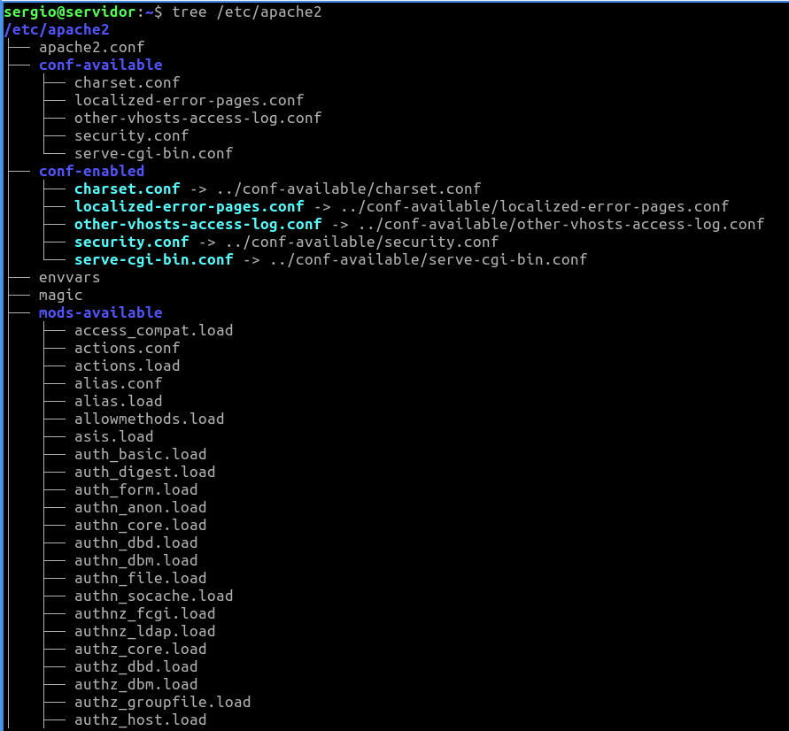
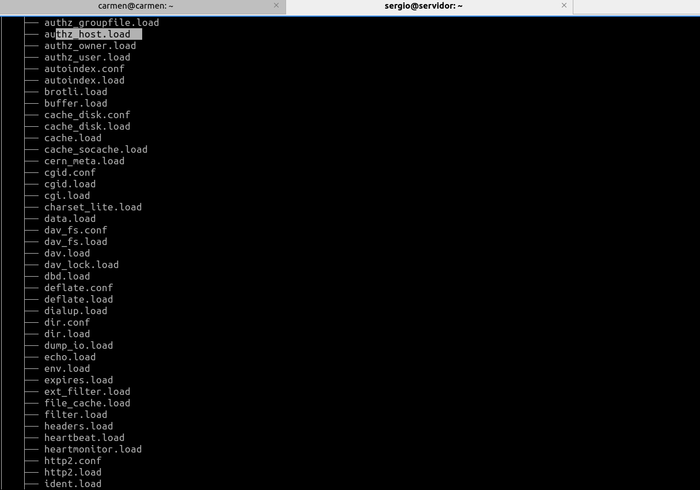

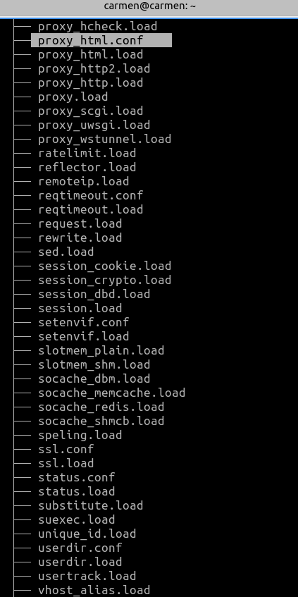
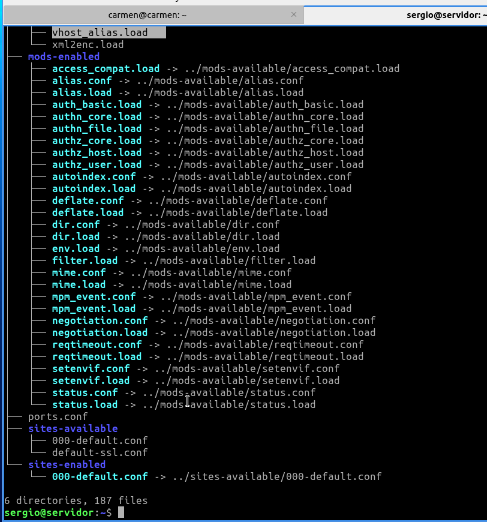


2. Algunas configuraciones de ejemplo del archivo **/etc/apache2/apache2.conf**:
```bash
<Directory /var/www/>
Options Indexes FollowSymlinks
AllowOverride None
Require all granted
</Directory>
. . .
AccessFileName .htaccess
. . .
Include ports.conf
. . .
KeepAlive On
```
Muestra la configuración por defecto de este archivo.

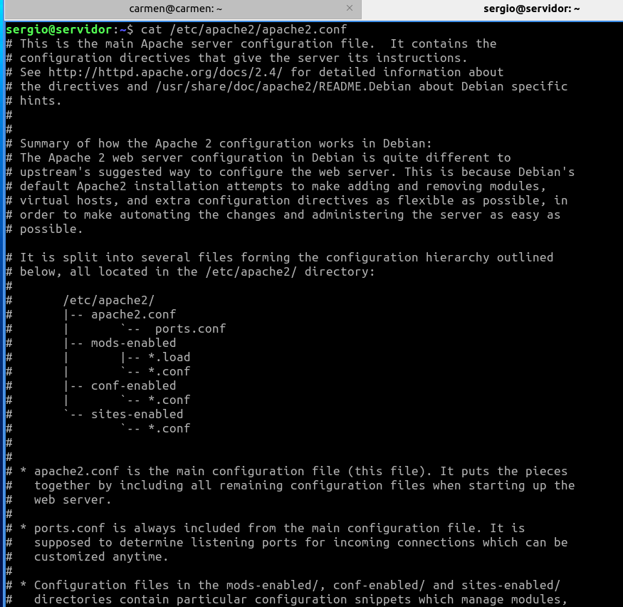
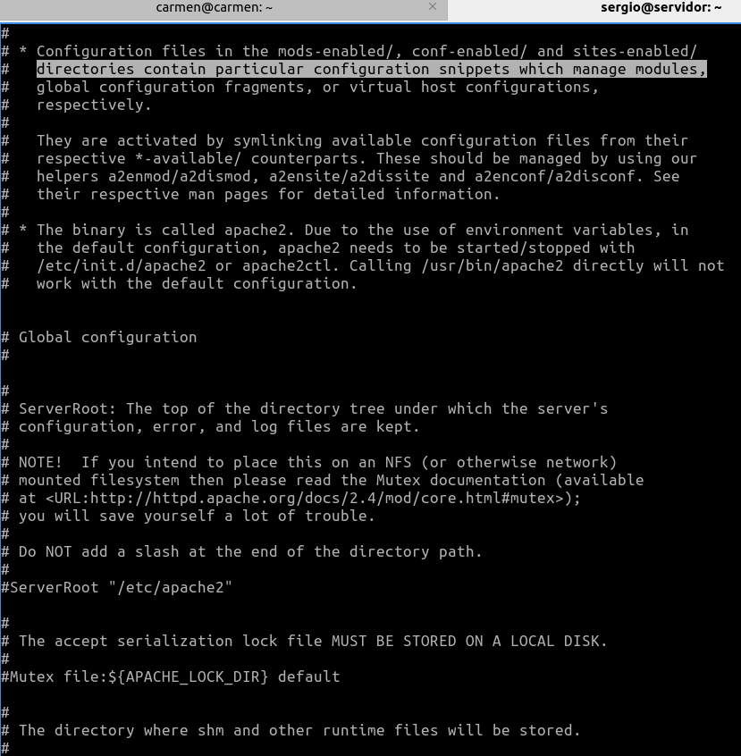
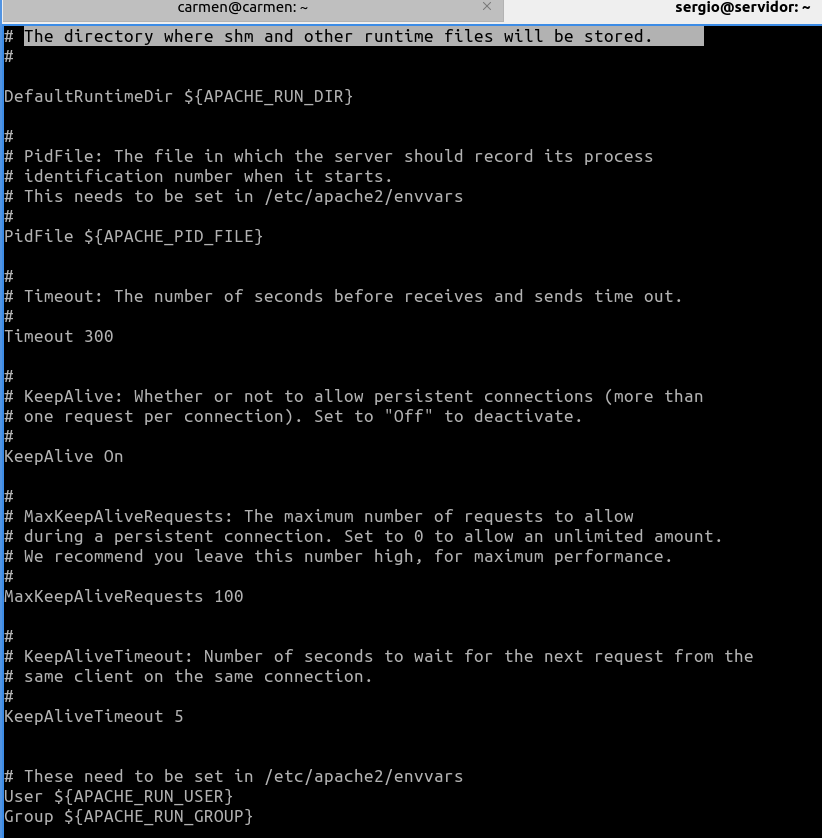
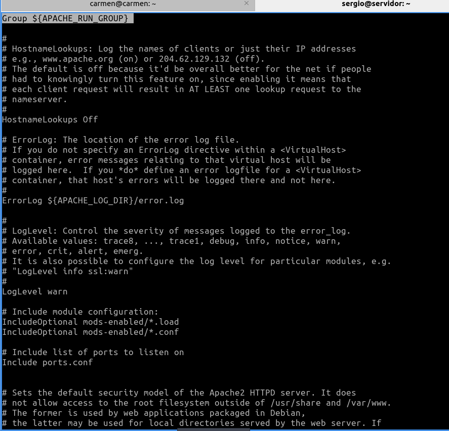
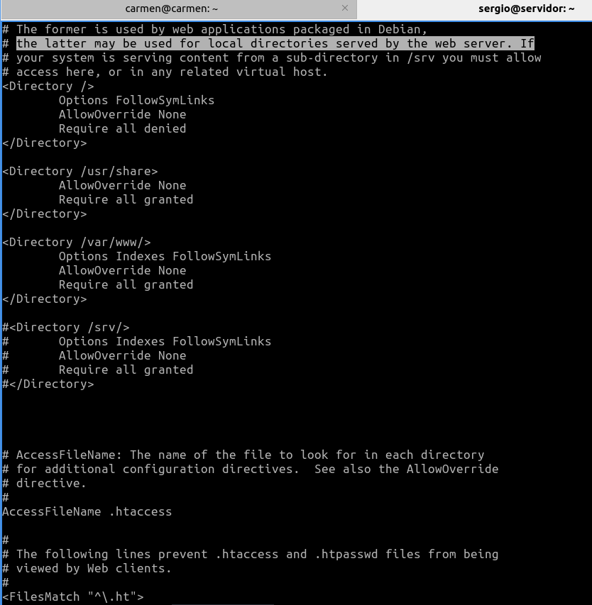
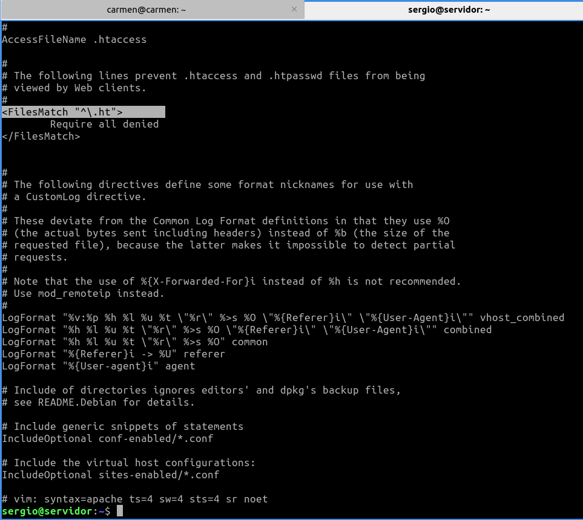

3. Algunas configuraciones de ejemplo del archivo **/etc/apache2/ports.conf**:
```bash
Listen 80
<IfModule ssl_module>
Listen 443
</IfModule>
<IfModule mod_gnutls.c>
Listen 443
</IfModule>
```
Muestra la configuración por defecto de este archivo.

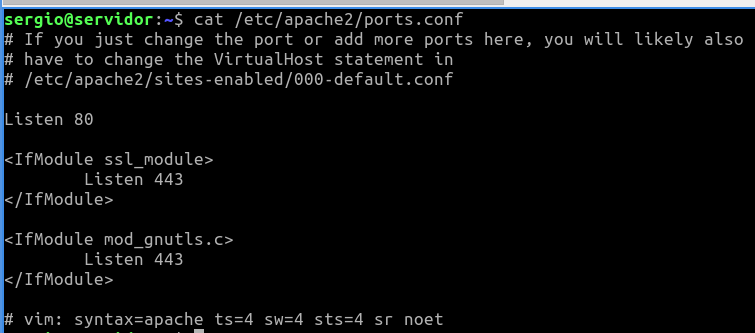


4. Algunas configuraciones de ejemplo de un archivo de host virtual: **/etc/apache2/sites-available/000-default.conf**:
```bash
<VirtualHost *:80>
#ServerName www.example.com
ServerAdmin webmaster@localhost
DocumentRoot /var/www/html
ErrorLog ${APACHE_LOG_DIR}/error.log
CustomLog ${APACHE_LOG_DIR}/access.log combined
</VirtualHost>
```
Muestra la configuración por defecto de este archivo.

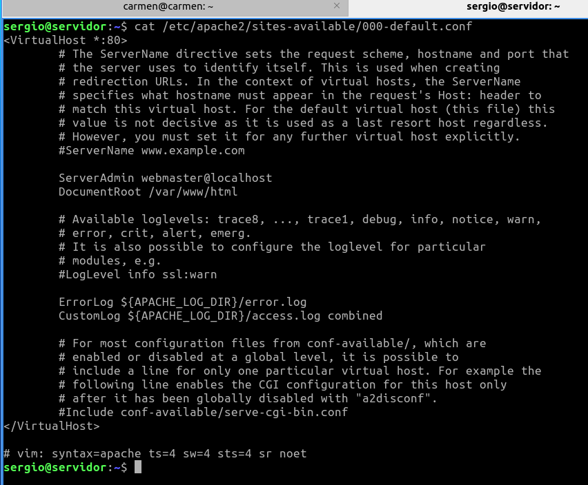


> También podemos crear hosts virtuales asociados a un puerto diferente, de modo que si
indicamos diferentes puertos nos permite acceder a diferentes sitios, por ejemplo:
**<VirtualHost *:8080>**, **<VirtualHost *:8081>**, ... Previamente estos puertos deben
estar a la escucha configurados en el **archivo /etc/apache2/ports.conf**:
>```bash
>Listen 80
>Listen 8080
>```

> Los ficheros de hosts virtuales se cargan en orden alfabético (por su nombre de fichero).
Siempre que accedamos a nuestro servidor a través la IP, se mostrará el contenido del primer
virtual host cargado. Recordemos que cuando accedemos al servidor por un nombre que no
coincide con ningún virtual host, o mediante la IP, se mostrará el contenido del primer Virtual
Host cargado (alfabéticamente).

# 4.- Verificar archivos de configuración
1. Podemos comprobar los archivos de configuración de apache2 con el comando:
```bash
apache2ctl configtest

apache2ctl status
```
> Este comando muestra los resultados en un navegador de línea de comandos. Si no tienes ninguno instalado, instala el navegador links.

```bash
sudo apt install links
```

# 5.- Configurar host virtuales
1. El hosting compartido consiste en el mantenimiento de diferentes sitios web (independientes entre
ellos) en el mismo servidor, compartiendo recursos.

Por defecto **apache2** crea un sitio web en **/var/www/html** formado por un único archivo:
**index.html**. Este sitio está configurado en **/etc/apache2/sites-available/000-
default.conf**. Puedes usar este archivo de configuración de plantilla para configurar otros sitios
web.

Para crear otro sitio web, por ejemplo: **www.misitio.com**, debes crear una carpeta hermana a
**html**, por ejemplo: **/var/www/misitio.com**. Cada sitio web debe tener un archivo de
configuración, siguiendo con el ejemplo anterior esta podría ser: **/etc/apache2/sitesavailable/
misitio.com.conf**. Puedes usar la plantilla** /etc/apache2/sitesavailable/
000-default.conf** para no empezar desde cero. En nuestro ejemplo nuestro archivo
de configuración podría contener la siguiente configuración: