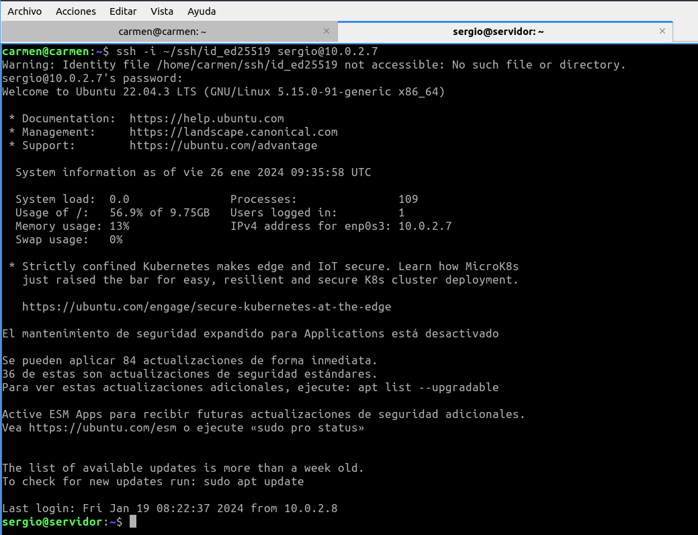
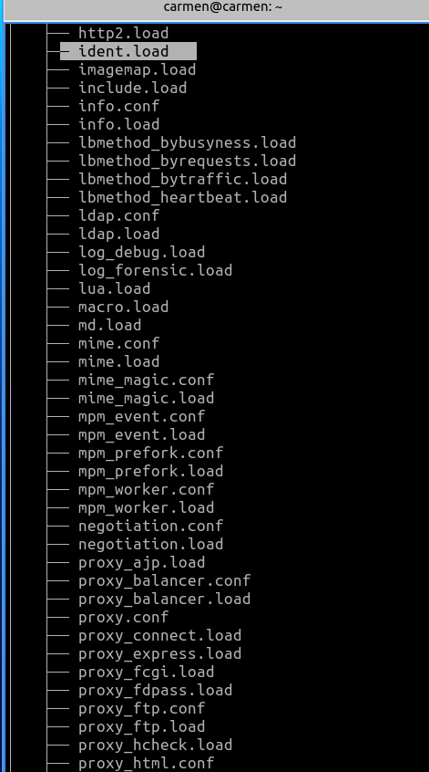
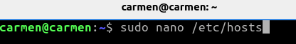
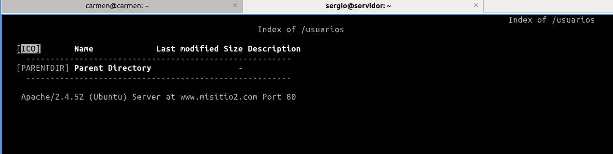
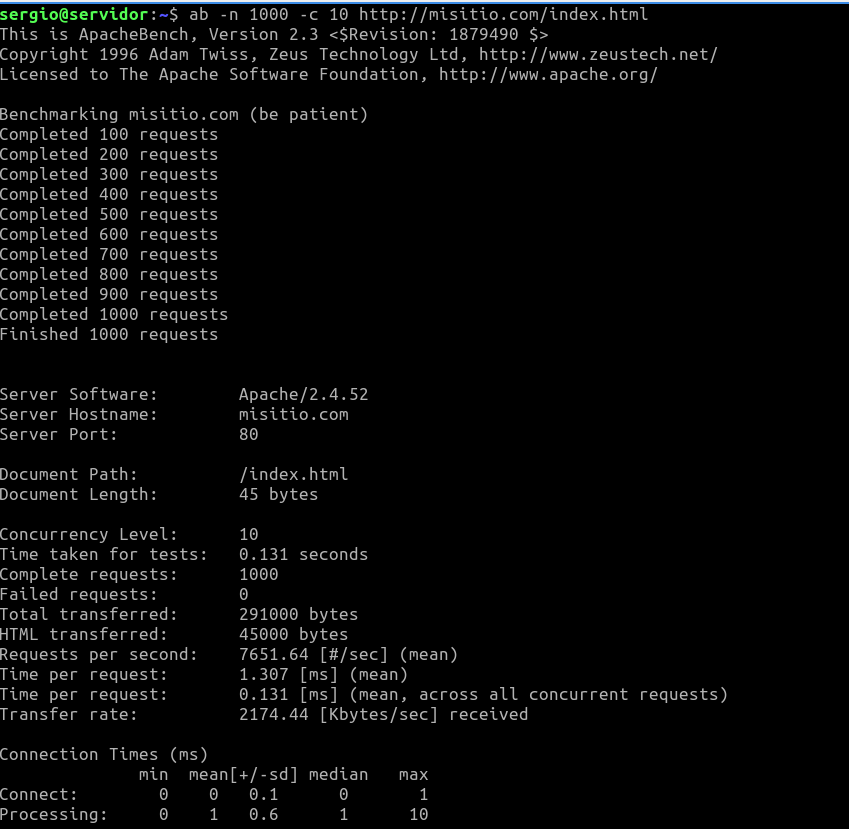
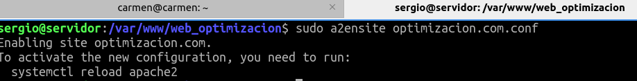

# SERVIDOR WEB Apache 2
* https://despliegue.codeandcoke.com/apuntes:servidores_web
* http://jamj2000.github.io/despliegueaplicacionesweb/2/diapositivas#/2
* https://despliegue.abrilcode.com/doku.php?id=bloque3:web
* https://plataforma.josedomingo.org/pledin/cursos/apache24/index.html

# 1.- Infraestructura
Reutilizaremos las MV de la práctica de **ssh**. Dos MV dentro de una **red NAT**:
* **Servidor**: con un Ubuntu server sin entorno gráfico.
    * Usuario: **sergio**, contraseña: **sergio**.
* **Casa**: con un Lubuntu con el entorno gráfico por defecto (LXQt).
    * Usuario: **carmen**, contraseña: **carmen**.

Desde el equipo **Casa** nos conectaremos al equipo **Servidor** mediante una conexión **ssh** autentificándonos
mediante claves asimétricas **ed25519**.

# 2.- Instalación y uso básico
1. Acceder al servidor:
```bash
ssh -i ~/.ssh/id_ed25519 10.0.2.4
```
> Casi toda la instalación y configuración la debemos hacer con privilegios de administrador
podemos ejecutar **sudo** en todas las instrucciones o cambiar al usuario administrador **sudo su**.



2. Instalar Apache y ver versión:
```bash
sudo apt update
sudo apt install apache2
apache2 -v
```
>La instalación crea el usuario **www-data** que ejecuta el servicio denominado **apache2**. Puedes
comprobar el usuario mostrando el contenido del archivo **cat /etc/passwd | grep wwwdata**
y ver el proceso en ejecución con: **ps -aux | grep www-data**

3. Comprobar estado del servicio **apache2**:
```bash
sudo systemctl status apache2
```


4. Con los siguientes comandos lo activaremos para que se inicie al arrancar el servidor y lo iniciaremos:
```bash
sudo systemctl enable apache2
sudo systemctl start apache2
```


>Otras comandos del servicio son:
>```bash
>sudo systemctl [enable|start|restart|status|reload|show|disable] apache2
>```
5. Apache trae un funcionalidad para gestionar el servicio: **apache2ctl**.
```bash
apache2ctl [-k start|restart|graceful|graceful-stop|stop]
```
Por ejemplo:
```bash
sudo apache2ctl -h

sudo apache2ctl -M
```
Esta herramienta también nos ofrece información del servidor:
* **apache2ctl -t**: Comprueba la sintaxis del fichero de configuración.
* **apache2ctl -M**: Lista los módulos cargados.
* **apache2ctl -S**: Lista los sitios virtuales y las opciones de configuración.
* **apache2ctl -V**: Lista las opciones de compilación

6. Reglas firewall:
```bash
sudo ufw enable
sudo ufw allow Apache
sudo ufw status verbose
```
> También puedes añadir la regla con: **sudo ufw allow 80/tcp**.


7. Probar desde el cliente qué puertos tiene abiertos el servidor, en nuestro ejemplo desde el equipo
**Casa** ejecutaremos:
```bash
nmap 10.0.2.4 -p 1-1024
```
>Por defecto el servicio HTTP utiliza el puerto 80.

>Si no tienes instalada esta utilidad, instalalá con: **sudo apt install nmap**. Esta
comprobación también se puede hacer desde el propio servidor, pero es menos fiable que
desde otro equipo ya que puede conectarse por la interfaz de loopback.


8. Comprobar en el equipo **Servidor** qué conexiones tiene abiertas:
```bash
sudo ss -natu

o

sudo ss -natup | grep apache2
```


# 3.- Archivos de configuración
1. Los archivos de configuración de **apache2** se encuentran en la carpeta **/etc/apache2/**.
```bash
/etc/apache2
├── apache2.conf
├── conf-available
│ ├── ...
├── conf-enabled
│ ├── ...
├── envvars
├── magic
├── mods-available
│ ├── ...
├── mods-enabled
│ ├── ...
├── ports.conf
├── sites-available
│ ├── 000-default.conf
│ └── default-ssl.conf
└── sites-enabled
└── 000-default.conf -> ../sites-available/000-default.conf
```
* **apache2.conf**: El fichero de configuración principal de Apache, donde se pueden realizar
cambios generales
* **envvars**: Contiene la configuración de las variables de entorno
* **ports.conf**: Contiene la configuración de los puertos donde Apache escucha
* **conf-available**: Contiene ficheros de configuración adicionales para diferentes aspectos de
Apache o de aplicaciones web como phpMyAdmin
* **conf-enabled**: Contiene una serie de enlaces simbólicos a los ficheros de configuración
adicionales para activarlos. Puede activarse o desactivarse con los comandos **a2enconf** o
**a2disconf**
* **mods-available**: Contiene los módulos disponibles para usar con Apache
* **mods-enabled**: Contiene enlaces simbólicos a aquellos módulos de Apache que se
encuentran activados en este momento. Se crean utilizando los comandos **a2enmod** y
**a2dismod** que más adelante explicaremos con más detalle
* **sites-available**: Contiene los ficheros de configuración de cada uno de los hosts virtuales
configurados y disponibles (activos o no).
* **sites-enabled**: Contiene una serie de enlaces simbólicos a los ficheros de configuración
cuyos hosts virtuales se encuentran activos en este momento. Se crean a través de los
comandos **a2ensite** y **a2dissite** que más adelante explicaremos con más detalle.

Muestra con la instrucción **tree** la estructura de archivos del directorio **/etc/apache2/**.





2. Algunas configuraciones de ejemplo del archivo **/etc/apache2/apache2.conf**:
```bash
<Directory /var/www/>
Options Indexes FollowSymlinks
AllowOverride None
Require all granted
</Directory>
. . .
AccessFileName .htaccess
. . .
Include ports.conf
. . .
KeepAlive On
```
Muestra la configuración por defecto de este archivo.


3. Algunas configuraciones de ejemplo del archivo **/etc/apache2/ports.conf**:
```bash
Listen 80
<IfModule ssl_module>
Listen 443
</IfModule>
<IfModule mod_gnutls.c>
Listen 443
</IfModule>
```
Muestra la configuración por defecto de este archivo.


4. Algunas configuraciones de ejemplo de un archivo de host virtual: **/etc/apache2/sites-available/000-default.conf**:
```bash
<VirtualHost *:80>
#ServerName www.example.com
ServerAdmin webmaster@localhost
DocumentRoot /var/www/html
ErrorLog ${APACHE_LOG_DIR}/error.log
CustomLog ${APACHE_LOG_DIR}/access.log combined
</VirtualHost>
```
Muestra la configuración por defecto de este archivo.


> También podemos crear hosts virtuales asociados a un puerto diferente, de modo que si
indicamos diferentes puertos nos permite acceder a diferentes sitios, por ejemplo:
**<VirtualHost *:8080>**, **<VirtualHost *:8081>**, ... Previamente estos puertos deben
estar a la escucha configurados en el **archivo /etc/apache2/ports.conf**:
>```bash
>Listen 80
>Listen 8080
>```

> Los ficheros de hosts virtuales se cargan en orden alfabético (por su nombre de fichero).
Siempre que accedamos a nuestro servidor a través la IP, se mostrará el contenido del primer
virtual host cargado. Recordemos que cuando accedemos al servidor por un nombre que no
coincide con ningún virtual host, o mediante la IP, se mostrará el contenido del primer Virtual
Host cargado (alfabéticamente).

# 4.- Verificar archivos de configuración
1. Podemos comprobar los archivos de configuración de apache2 con el comando:
```bash
apache2ctl configtest

apache2ctl status
```
> Este comando muestra los resultados en un navegador de línea de comandos. Si no tienes ninguno instalado, instala el navegador links.

```bash
sudo apt install links 

ó

sudo apt install lynx
```


# 5.- Configurar host virtuales
1. El hosting compartido consiste en el mantenimiento de diferentes sitios web (independientes entre
ellos) en el mismo servidor, compartiendo recursos.

Por defecto **apache2** crea un sitio web en **/var/www/html** formado por un único archivo:
**index.html**. Este sitio está configurado en **/etc/apache2/sites-available/000-
default.conf**. Puedes usar este archivo de configuración de plantilla para configurar otros sitios
web.

Para crear otro sitio web, por ejemplo: **www.misitio.com**, debes crear una carpeta hermana a
**html**, por ejemplo: **/var/www/misitio.com**. Cada sitio web debe tener un archivo de
configuración, siguiendo con el ejemplo anterior esta podría ser: **/etc/apache2/sites-available/
misitio.com.conf**. Puedes usar la plantilla** /etc/apache2/sitesavailable/
000-default.conf** para no empezar desde cero. En nuestro ejemplo nuestro archivo
de configuración podría contener la siguiente configuración:
```bash
<VirtualHost *:80>
ServerAdmin tuApellido@misitio.com
DocumentRoot "/var/www/misitio.com"
ServerName misitio.com
ServerAlias www.misitio.com
ErrorLog ${APACHE_LOG_DIR}/misitio.com-error.log
CustomLog ${APACHE_LOG_DIR}/misitio.com-access.log combined
</VirtualHost>
```


>Recuerda que los ficheros servidos deben ser propiedad del usuario y grupo que usa Apache,
es decir usuario **www-data** y grupo **www-data**.

```bash
sudo chown -R www-data:www-data /var/www/misitio.com
```


Configura el host virtual **misitio.com** según la información anterior.

2. Cuando hayamos terminado el archivo de configuración del nuevo host virtual, podemos activarlo
utilizando el comando **a2ensite** (**a**pache**2** **en**able **site**). Automáticamente se creará un enlace
simbólico con la configuración del sitio web de **sites-available** en **sites-enabled**:

```bash
sudo a2ensite misitio.com.conf
```


>Es lo mismo que hacer el enlace simbólico a mano:
>```bash
>sudo ln -s ../sites-avaiable/misitio.com.conf /etc/apache2/sitesenabled/
>misitio.com.conf
>```

>Para desactivar el sitio web usaremos el comando **a2dissite** (apache2 disable site).

3. Reiniciamos el servicio **apache2**.
```bash
sudo systemctl restart apache2
sudo systemctl status apache2
```


4. Por simplicidad y para no tener que configurar un **servidor DNS** para indicarle a nuestro ordenador
que el dominio **misitio.com** apunta a la dirección IP de nuestro servidor. Editaremos el archivo
**/etc/hosts** que hace las funciones de DNS local:
```bash
127.0.0.1 localhost
127.0.1.1 servidor
127.0.0.1 misitio.com www.misitio.com
```
Si queremos probar desde el equipo **Casa** deberemos editar dicho archivo en ese equipo pero
indicándo la dirección IP de **Servidor**:
```bash
127.0.0.1 localhost
127.0.1.1 casa
10.0.2.4 misitio.com www.misitio.com
```


>En Windows este fichero se encuentra en: **c:\Windows\System32\Drivers\etc\hosts**.

En ambos casos podemos comprobar que resuelve el nombre con:
```bash
ping -c 3 misitio.com
y
ping -c 3 www.misitio.com
```


Y podemos ver la web con el navegador de línea de comandos con:
```bash
links http://misitio.com
y
links http://www.misitio.com
```


> Letra **q** para salir.

Desde el equipo **Casa** también podemos comprobar que en el navegador se pueden acceder a la web:
**http://misitio.com** y **http://www.misitio.com**.


5. Los registros (logs) los ponemos ver desde el equipo **Servidor** con:
```bash
tail /var/log/apache2/misitio.com-access.log
y
tail /var/log/apache2/misitio.com-error.log
```


También podemos comprobar las conexiones con el comando:
```bash
apache2ctl status
```


# 6.- Configurar autenticación básica (AuthType Basic)

El problema de este sistema es que las contraseñas viajan en texto plano sin ningún tipo de encriptación.
1. Esta autentificación básica utiliza el módulo de Apache: **mod_auth_basic**. Normalmente este
módulo viene activo. Si no fuese así lo podemos activar con:

```bash
apache2ctl -M
sudo a2enmod auth_basic
sudo systemctl restart apache2
```


2. Necesitamos tener instalada la utilidad **htpasswd** que está en el paquete **apache2-utils**.
```bash
sudo apt install apache2-utils -y
apt-cache show apache2-utils
```


3. Creamos un archivo nuevo **.htpasswd** con un nuevo usuario usuario llamado **tuapellido**:
```bash
sudo htpasswd -c /etc/apache2/.htpasswd jose
```


> Hemos llamado al archivo de contraseñas **.htpasswd** pero se podría haber llamado, por
ejemplo: **passwd.txt**. Por seguridad el archivo no debería estar en la carpeta de publicación
de Apache.

Creamos un segundo usuario sobre el archivo **.htpasswd** ya existente:

```bash
sudo htpasswd /etc/apache2/.htpasswd paco
```


> Si el archivo **.htpasswd** ya está creado debemos quitar el **-c**.
Podemos ver el contenido del fichero recién creado. Las contraseñas estarán cifradas:
```bash
sudo chown www-data:www-data /etc/apache2/.htpasswd
```


4. Creamos un nuevo sitio web **misitio2.com** con el siguiente archivo de configuración.


Restringiremos el acceso a la carpeta **usuarios** del sitio web. Esto se indicará en la configuración de
la directiva **Directory**.


```bash
<VirtualHost *:80>
    ServerAdmin tuApellido@misitio2.com
    DocumentRoot /var/www/misitio2.com
    ServerName misitio2.com
    ServerAlias www.misitio2.com
    ErrorLog ${APACHE_LOG_DIR}/logs/misitio2.com-error.log
    CustomLog ${APACHE_LOG_DIR}/logs/misitio2.com-access.log combined
    <Directory /var/www/misitio2.com/usuarios >
        AuthType Basic
        AuthName "Acceso Restringido a Usuarios"
        AuthUserFile /etc/apache2/.htpasswd
        Require valid-user
    </Directory>
</VirtualHost>
```


>Revisa los pasos que vimos en el apartado **Configurar host virtuales** para crear este nuevo
sitio web.

>Recuerda crear la nueva carpeta **usuarios** en el lugar y con los permisos adecuados.





>Recuerda que puedes comprobar los archivos de configuración con **apache2ctl configtest**.


5. Reiniciamos el servicio **apache2**.
```bash
sudo systemctl restart apache2
sudo systemctl status apache2
```


6. Ahora podemos probar el sitio web tanto por terminal en **Servidor** y **Casa** como con el navegador
desde Casa. Primero podemos acceder a la dirección **http://misitio2.com** y comprobar que la
web funciona con normalidad. Después podemos acceder a **http://misitio2.com/usuarios** y
comprobar como aparece una ventana solicitando que nos identificamos mediante un usuario y una
contraseña.





>Recuerda añadir las nuevas direcciones al archivo **hosts** de los equipos en los que quieras
comprobar el acceso al sitio web.

# 7.- Configurar autenticación Digest (AuthType Digest)
Para solucionar el problema de que las contraseñas viajen en texto plano se puede utilizar un mecanismo
hash para el envío de estas.
1. Esta autentificación digest utiliza el módulo de Apache: **mod_auth_digest**. Normalmente este
módulo viene activo. Si no fuese así lo podemos activar con:

```bash
apache2ctl -M
sudo a2enmod auth_digest
sudo systemctl restart apache2
```


2. Creamos un nuevo sitio web **misitio3.com** semejante a los anteriores. En este ejemplo
restringiremos el acceso a la carpeta **privado** del sitio web:


```bash
<VirtualHost *:80>
    ....
    <Directory "/var/www/misitio3.com/privado">
        AuthType Digest
        AuthName "despliegue"
        AuthUserFile /etc/apache2/.htdigest
        Require valid-user
    </Directory>
</VirtualHost>
```

> En este tipo de autenticación se utiliza el valor de la directiva **AuthName** como nombre de
dominio **realm** para generar el usuario y la contraseña.

3. Para crear los usuarios usaremos la herramienta **htdigest**:
```bash
sudo htdigest -c /etc/apache2/.htdigest despliegue jose
```


> Hemos llamado al archivo de contraseñas **.htdigest** pero se podría haber llamado, por
ejemplo: **passwd.txt**. Por seguridad el archivo no debería estar en la carpeta de publicación
de Apache.

Podemos ver el contenido del fichero recién creado. En este caso los usuario y las contraseñas
estarán cifradas:
```bash
sudo cat /etc/apache2/.htdigest
```


4. Asignamos la propiedad del fichero y el grupo al usuario y grupo sobre el que se ejecuta Apache
**www-data**. 
```bash
sudo chown www-data:www-data /etc/apache2/.htdigest
```


5. Ahora podemos probar el sitio web tanto por terminal en **Servidor** y **Casa** como con el navegador
desde **Casa**. Primero podemos acceder a la dirección **http://misitio3.com** y comprobar que la
web funciona con normalidad. Después podemos acceder a **http://misitio3.com/privado** y
comprobar como aparece una ventana solicitando que nos identificamos mediante un usuario y una
contraseña.


# 8.- Configurar Configurar SSL/TLS (HTTPS)
SSL (Secure Socket Layer) es un protocolo de seguridad que nació con el objetivo de cifrar las
comunicaciones entre los servidores web y los navegadores de forma que, si se interceptaba la conexión,
nunca se pudiera desvelar el contenido de la misma. Con el paso del tiempo se han ido encontrando
diversas vulnerabilidades críticas que han hecho que la recomendación sea user un nuevo protocolo
llamado TLS (Transport Secure Layer).

El primer paso para configurar SSL en Apache será crear el certificado y la clave, que se quedarán
almacenados en /etc/apache2/certs. Para eso primero creamos la carpeta y luego el certificado y su
correspondiente clave.

Hay que tener en cuenta que estamos creando un certificado autofirmado. Este tipo de certificados sólo se
deben usar con el propósito de enseñar o hacer una demostración puesto que en la práctica no son válidos.
El navegador no confiará en él porque somos nosotros quienes lo hemos firmado. Los certificados, para que
sean válidos, deben ser validados por una entidad certificadora. Más adelante veremos como el navegador
avisa al usuario de que el certificado no es fiable (aunque siempre le mostrará la opción de continuar a
pesar de ello)

1. Creamos el certificado y guardamos la clave privada **misitio4.key** y la clave pública
**misitio4.crt**: En la ubicación por defecto de SSL:

```bash
sudo openssl req -x509 -nodes -days 365 -newkey rsa:4096 \
-keyout /etc/ssl/private/misitio4.key \
-out /etc/ssl/certs/misitio4.crt
```
O en una carpeta dentro de la configuración de Apache.

```bash
sudo mkdir /etc/apache2/certs
sudo openssl req -x509 -nodes -days 365 -newkey rsa:4096 \
            -keyout /etc/apache2/certs/misitio4.key \
            -out /etc/apache2/certs/misitio4.crt
```

>Contestaremos a las preguntas que nos vayan haciendo por terminal con:
* Country Name (2 letter code) [AU]: **ES**
* State or Province Name (full name) [Some-State]: **Almeria**
* Locality Name (eg, city) []: **Aguadulce**
* Organization Name (eg, company) [Internet Widgits Pty Ltd]* : **IES Aguadulce**
* Organizational Unit Name (eg, section) []: **LMSGI**
* Common Name (e.g. server FQDN or YOUR name) []: **misitio4.com**
* Email Address []: **tuApellido**@misitio4.com


2. Activamos el módulo SSL:
```bash
sudo a2enmod ssl
```


3. Comprobamos que el puerto de HTTPS (443) está configurado en el archivo
**/etc/apache2/ports.conf**.

>Suele estar dentro de una condicional **IfModule**.


4. Añadimos la regla al firewall.
```bash
sudo ufw app list
sudo ufw allow "Apache Secure"
sudo ufw allow 443/tcp
```


5. Creamos y configuramos un nuevo sitio web **misitio4.com** con soporte de conexión segura SSL.
Creamos la carpeta y el **index.html** correspondiente. Hacemos una copia de la plantilla
**/etc/apache2/sites-availables/default-ssl.conf** y la configuramos como en el siguiente
ejemplo:

```bash
cp /etc/apache2/sites-available/default-ssl.conf
/etc/apache2/sites-available/misitio4.com.conf
```

```bash
<VirtualHost *:443>
    ServerAdmin tuApellido@misitio4.com
    DocumentRoot /var/www/misitio4.com
    ServerName misitio4.com
    ServerAlias www.misitio4.com
    ErrorLog ${APACHE_LOG_DIR}/misitio4.com-error.log
    CustomLog ${APACHE_LOG_DIR}/misitio4.com-access.log combined
    SSLEngine On
    SSLCertificateFile /etc/ssl/certs/misitio4.crt
    SSLCertificateKeyFile /etc/ssl/private/misitio4.key
    SSLProtocol All -SSLv3
</VirtualHost>
```
o con la ruta a la carpeta de configuración de Apache.

```bash
SSLCertificateFile /etc/apache2/certs/misitio4.crt
SSLCertificateKeyFile /etc/apache2/certs/misitio4.key
```


6. Activar el sitio y reiniciar apache.


7. Comprobar la conexión HTTPS desde **Servidor** con el navegador **links** y desde **Casa** con el
navegador Firefox. Como el certificado es autofirmado el navagador nos deberá avisar de que la
conexión no es segura ya que no puede comprobar nuestro certificado en una Autoridad
Certificadora (CA). Para acceder debemos aceptar el certificado. En **links** solo debes contestar a la
pregunta. En firefox pulsaremos sobre **Avanzado** y después **Aceptar el riesgo y continuar**.


Ya podemos acceder a la web. Para ver el cerfificado pulsaremos sobre el **icono del candado** de la
barra de direcciones, **Conexión no segura** y **Más información**.


1. Comprobar el tráfico no seguro HTTP del sitio web **misitio4.com**.

Si probamos a acceder a **http://misitio4.com** sin la s veremos que accedemos al sitio web por
defecto **000-default.conf** ya que no hemos configurado nada en este sitio web para el puerto 80
de HTTP.


2. Redirección de tráfico no seguro HTTP a HTTPS.

Nos puede interesar que todo el tráfico del sitio web se vea forzado a utilizar el protocolo seguro
HTTPS. Incluso aunque el usuario introduzca la URL directamente y decide navegar utilizando HTTP
(http://...) nosotros podemos redirigirle hacia la opción de utilizar la opción segura.

En este caso solo hace falta añadir la conexión HTTP del puerto 80 a nuestro archivo de configuración
**/etc/apache2/sites-available/misitio4.com.conf**. Podemos configurar el host virtual no
seguro (**<VirtualHost *:80>**) con las opciones mínimas para redirigirlo al seguro. No haría falta ni
incluir la opción **DocumentRoot**.

```bash
<VirtualHost *:80>
    ServerName misitio4.com
    ServerAlias www.misitio4.com
    Redirect / https://misitio4.com/
</VirtualHost>
<VirtualHost *:443>
    ServerName misitio.com
    DocumentRoot . . .
    . . .
</VirtualHost>
```

>Si queremos podemos optar por una redirección permanente (de esta forma así se notificará a
los buscadores) modificando la orden **Redirect** por la siguiente:
>```bash
>Redirect permanent / https://misitio4.com/
>```

3. Reiniciar apache y comprobar el redireccionamiento de **http://misitio4.com** y
**http://www.misitio4.com**.


# 9. Configurar autenticación distribuida (.htaccess)
Este método nos permite definir diferentes directivas de configuración para cada directorio (con sus
respectivos subdirectorios) sin necesidad de editar los archivos de configuración del directorio
**/etc/apache2/sites-available** de Apache.

Para ello crearemos un fichero **.htaccess** que guardaremos en la carpeta del sitio que queremos proteger
y que contendrá la configuración específica de ese directorio la que antes indicabamos en la directiva
**Directory** del archivo de configuración ***.conf**.

Para permitir el uso de los ficheros **.htaccess** y/o restringir las directivas que se pueden aplicar usamos la
directiva **AllowOverride**. Esta directiva puede tomar uno o varios de los siguientes valores:
* **All**: Se pueden usar todas las directivas permitidas.
* **None**: Se ignoran los ficheros **.htaccess**. Valor por defecto.
* **AuthConfig**: Directivas de autentificación y autorización: AuthName, AuthType, AuthUserFile, Require, …
* **FileInfo**: Directivas relacionadas con el mapeo de URL: redirecciones, módulo rewrite, …
* **Indexes**: Directiva que controlan la visualización de listado de ficheros.
1. Lo primero que tenemos que hacer es comprobar el estado de la directiva **AllowOverride** del
archivo de configuración general **/etc/apache2/apache2.conf** para el directorio dónde se
publican los sitios web **/var/www**.

Cambiaremos el valor a **AllowOverride All** para permitir dichas modificaciones. Así, la política
sobre dicho directorio podrá ser diferente a la establecida en la carpeta si asi se define con algún
fichero **.htaccess**.


2. Por ejemplo en nuestro primer sitio web **misitio.com** podemos crear un nuevo directorio
**confidencial** y aplicar la autentificación Digest con el archivo de usuarios que creamos en el
apartado **Configurar autenticación Digest (AuthType Digest)**. El archivo de configución
**.htaccess** para esta configuración podría ser el siguiente:


```bash
AuthType Digest
AuthName "despliegue"
AuthUserFile /etc/apache2/.htdigest
Require valid-user
```


3. Ahora podemos probar el sitio web tanto por terminal en **Servidor** y **Casa** como con el navegador
desde **Casa**. Primero podemos acceder a la dirección **http://misitio.com** y comprobar que la
web funciona con normalidad. Después podemos acceder a **http://misitio.com/confidencial**
y comprobar como aparece una ventana solicitando que nos identificamos mediante un usuario y una
contraseña.


4. También podemos impedir, por ejemplo, que los ficheros de un directorio puedan ser listados por
cualquier visitante. Basta con crear un fichero **.htaccess** y añadir la siguiente directiva que indica
que no puede listarse el directorio.
```bash
Options -Indexes
```
> No olvidar el signo - para indicar restricción.

Para probarlo vamos a crear un nuevo directorio **carpeta** en nuestro primer sitio web **misitio.com**
que contenga dos imágenes. Antes de crear el archivo **.htaccess** vamos a probar que desde el
navegador del equipo **Casa** podemos ver en **http://misitio.com/carpeta** el listado de archivos
de ese directorio.

5. Añade a dicha carpeta el archivo **.htaccess** adecuado.

6. Vuelve a probar que desde el navegador del equipo **Casa** ya no podemos ver el listado de archivos de
ese directorio.


# 10.- Monitorización (GoAccess)

Información extraida de la web: https://despliegue.codeandcoke.com/apuntes:servidores_web

**GoAccess** es una analizador visual de logs de Apache en tiempo real. De esa manera permite monitorizar el
acceso y uso al servidor por parte de los usuarios en cada momento con numerosas métricas.
1. Lo primero de todo es instalarlo en nuestro servidor:
```bash
sudo apt-get update
sudo apt-get install goaccess
```


2. Podemos usarla de dos maneras, visualizando los resultados en el terminal o en formato HTML como
una web.

Para visualizarlos en el terminal, basta localizar el fichero log de Apache que queremos monitorizar
(en este caso el fichero general, pero podríamos pasar los ficheros log de los diferentes hosts
virtuales que hayamos configurado) y ejecutamos la aplicación tal y como se muestra en el siguiente
ejemplo:
```bash
sudo goaccess /var/log/apache2/misitio.com-access.log -c
```


Y tras elegir el formato de fichero log que usamos (pulsando espacio y después intro. NCSA
Combined Log Format), podemos visualizar algo como la captura siguiente:


Respuesta:


3. También podemos pedirle a GoAccess que prepare un documento HTML en tiempo real donde
podremos ver las estadísticas en tiempo real desde el navegador.
```bash
sudo goaccess /var/log/apache2/misitio.com-access.log \-o /var/www/misitio.com/report.html \--log-format=COMBINED \--real-time-html
```
Accedemos al archivo html que le hemos indicado en la opción **-o**, en el ejemplo:
**http://misitio.com/report.html**.


Y este será el aspecto que tendrá, donde además podremos ir monitorizando el uso del servidor web
puesto que se irá actualizando constatemente sin necesidad de recargar la página.


Respuesta:


# 11.- Pruebas de carga

ab: Apache HTTP server benchmarking tool

https://httpd.apache.org/docs/current/programs/ab.html

Ejemplo de un test con 1000 peticiones y una concurrencia de 10:

```bash
ab -n 1000 -c 10 http://misitio.com/index.html
```




Más información

```bash
ab -h
    Uso: ab [opciones] [http[s]://]nombrehost[:puerto]/ruta
    Las opciones son:
    -n requests Número de peticiones que se realizan
    -c concurrency Número de peticiones múltiples que se realizan
    -t timelimit Segundos de espera máx. a una respuesta
    -b windowsize Tamaño del búfer TCP de emisión/recepción, en bytes
    -p postfile Archivo que contiene los datos del POST. No olvide
    configurar también -T
    -u putfile Archivo que contiene los datos del PUT. No olvide
    configurar también -T
    -T content-type Cabecera content-type del POST, p.ej.,
    'application/x-www-form-urlencoded'
    El valor predeterminado es 'text/plain'
    -v nivel det. Cuánta información de resolución de problemas se
    imprime
    -w Imprimir resultado en tablas HTML
    -i Usar HEAD en lugar de GET
    -x atributos Cadena que se inserta como atributos de table
    -y atributos Cadena que se inserta como atributos de tr
    -z atributos Cadena que se inserta como atributos de td o th
    -C atributo Añadir cookie, p.e. 'Apache=1234. (repetible)
    -H atributo Añadir líneas de cabecera arbitrarias, p.ej.,
    'Accept-Encoding: gzip'
    Se insertan detrás de todas las líneas de cabecera normales.
    (repetible)
    -A atributo Añadir autenticación WWW básica, los atributos
    son username y password separados por dos puntos.
    -P atributo Añadir autenticación de proxy básica, los atributos
    son username y password separados por dos puntos.
    -X proxy:puerto Servidor proxy y número de puerto que se usa
    -V Imprimir número de versión y salir.
    -k Usar función KeepAlive de HTTP.
    -d No mostrar percentiles en tabla servida.
    -S No mostrar estimadores de confianza ni advertencias.
    -g nombrearch. Sacar los datos recopilados en un archivo de formato
    gnuplot
    -e nombrearch. Generar archivo CSV con los porcentajes servidos.
    -r No salir cuando se reciban errores de recepción en
    socket.
    -h Mostrar información de uso (este mensaje).
    -Z suite de cif Especifica suite de cifrado SSL/TLS (véase cifrados
    openssl).
    -f protocolo Especifica protocolo SSL/TLS (SSL2, SSL3, TLS1 o ALL
```

# 12.- Optimización
Se pueden usar muchas técnicas distintas, dependiendo de nuestras necesidades y de si nuestro sitio web
lo permite. Estas directivas pueden ir en los **archivos de configuración de los virtual hosts .conf** o en archivos **.htaccess**.

1. Instala git y clona el siguiente repositorio:
**https://github.com/jmoba/web_optimizacion.git**


2. Crea un nuevo **virtual host** llamado **optimizacion.com** para dicha web.





3. Realiza las siguientes optimizaciones mediante un archivo **.htaccess** en la carpeta principal del
proyecto web. Recuerda instalar los módulos indicados previamente mediante el comando **a2enmod**.

4. Especificar la caché del navegador (mod_expires)
```bash
<ifModule mod_expires.c>
    ExpiresActive On
    ExpiresByType image/jpg "access 1 year"
    ExpiresByType image/gif "access 1 year"
    ExpiresByType text/css "access 2 month"
    ExpiresByType text/html "access 1 month"
    ExpiresByType application/pdf "access 4 week"
    ExpiresByType text/x-javascript "access 1 month"
    # ExpiresByType application/x-shockwave-flash "access 1 month"
    ExpiresByType image/x-icon "access 1 year"
    ExpiresDefault "access 1 year"
<ifModule>
```
Muestra los archivos que has creado mediante **cat** y las estructura de archivos del sitio Web
mediante **tree**. Crea capturas con la herramienta de desarrolladores de tu navegador, sección Redes.
Recuerda que en la primera captura debes borrar las cookies. Graba la conexión para tener los datos
de tiempo. Deberas crear dos capturas una antes y otra después de cargar la caché en el navegador.
Debe observarse que el tiempo es menor en la segunda captura.

5. Comprimir las comunicaciones (mod_deflate)
```bash
<ifModule mod_deflate.c>
    AddOutputFilterByType DEFLATE application/javascript text/css
</ifModule>
```
```bash
<ifModule mod_deflate.c>
    <filesMatch "\.(js|css)$"> SetOutputFilter DEFLATE </filesMatch>
</ifModule>
```
```bash
<IfModule mod_deflate.c>
    AddOutputFilterByType DEFLATE text/html
    AddOutputFilterByType DEFLATE text/css
    AddOutputFilterByType DEFLATE text/javascript
    AddOutputFilterByType DEFLATE text/xml
    AddOutputFilterByType DEFLATE text/plain
    AddOutputFilterByType DEFLATE image/x-icon
    AddOutputFilterByType DEFLATE image/svg+xml
    AddOutputFilterByType DEFLATE application/rss+xml
    AddOutputFilterByType DEFLATE application/javascript
    AddOutputFilterByType DEFLATE application/x-javascript
    AddOutputFilterByType DEFLATE application/xml
    AddOutputFilterByType DEFLATE application/xhtml+xml
    AddOutputFilterByType DEFLATE application/x-font
    AddOutputFilterByType DEFLATE application/x-font-truetype
    AddOutputFilterByType DEFLATE application/x-font-ttf
    AddOutputFilterByType DEFLATE application/x-font-otf
    AddOutputFilterByType DEFLATE application/x-font-opentype
    AddOutputFilterByType DEFLATE application/vnd.ms-fontobject
    AddOutputFilterByType DEFLATE font/ttf
    AddOutputFilterByType DEFLATE font/otf
    AddOutputFilterByType DEFLATE font/opentype
    # For Olders Browsers Which Can't Handle Compression
    BrowserMatch ^Mozilla/4 gzip-only-text/html
    BrowserMatch ^Mozilla/4\.0[678] no-gzip
    BrowserMatch \bMSIE !no-gzip !gzip-only-text/html
</IfModule>
```
Crea una tercera captura con la herramienta de desarrolladores de tu navegador, sección Redes.
Graba la conexión para tener los datos de tiempo. Debe observarse que el tiempo es menor que en
las anteriores capturas. Revisa las cookies si no funciona como se espera.

6. OPCIONAL: Comprimir las comunicaciones (mod_gzip). Método más antiguo.
```bash
</ifModule>
    mod_gzip_item_include handler ^cgi-script$
    mod_gzip_item_include mime ^text/.*
    mod_gzip_item_include mime ^application/x-javascript.*
    mod_gzip_item_exclude mime ^image/.*
    mod_gzip_item_exclude rspheader ^Content-Encoding:.*gzip.*
</ifModule>
```
# ANEXOS: Ampliación
# 13.- Seguridad
Información extraida de la web: https://plataforma.josedomingo.org/pledin/cursos/apache24

1. Modulo **modSecurity**

Para instalar y activar el módulo ejecutamos:
```bash
sudo apt-get install libapache2-mod-security2
```
Por defecto el módulo trae una configuración recomendado, para activarla le cambiamos el nombre a
**.conf**:

```bash
cd /etc/modsecurity
mv modsecurity.conf-recommended modsecurity.conf
```

Cuando reiniciamos el servicio, se ha creado un nuevo fichero de log, donde **mod_security** va a
guardar información detallada de las peticiones y respuestas para posibles auditorias:
**/var/log/apache2/modsec_audit.log**.

Por defecto la configuración de **modsecurity** solo permite la detención de los ataques, pero no los
evita. En el fichero de configuración **/etc/modsecurity/modsecurity.conf**, podemos
encontrar:

```bash
SecRuleEngine DetectionOnly
```
Para evitar que se produzcan ataques podemos configurar el módulo en el fichero de configuración
**/etc/modsecurity/modsecurity.conf** con la directiva:
```bash
SecRuleEngine On
```
Podemos modificar otras directivas:

* **SecResponseBodyAccess**: Podemos desactivarla para evitar que se guarde el cuerpo de la
respuesta.
* **SecRequestBodyLimit**: Podemos especificar el tamaño máximo de los datos POST.
* **SecRequestBodyNoFilesLimit**: De forma similar podemos indicar el tamaño de los datos
POST menos el tamaño de los ficheros de subida. Este valor debe ser lo más pequeño posible
(128K) (se supone que si no tenemos en cuenta los ficheros subidos los datos que se mandan
por POST no deben ser muy grandes).
* **SecRequestBodyInMemoryLimit**: Indica el tamaño de RAM que se utiliza para cachear la
petición. Variar este parámetro puede tener consecuencia en el rendimiento del servidor.

Activando las reglas de detección: Por defecto tenemos un conjunto de reglas activadas, que
llamamos CRS (Core Rules Set). Si nos fijamos en el fichero de configuración del módulo
**/etc/apache2/mods-available/security2.conf**, ademas de indicar el directorio donde se va
a guardar información (directiva **SecDataDir**), incluye el fichero donde están definida las CRS:
```bash
IncludeOptional /usr/share/modsecurity-crs/owasp-crs.load
```
Las reglas se encuentran en el directorio **/usr/share/modsecurity-crs/rules**.

2. Ocultar versión y sistema

En el fichero ***/etc/apache2/conf-enabled/security.conf***, podemos configurar las directivas
**ServerSignature** y **ServerTokens**.
* **ServerTokens**: Donde configuramos la información devuelta en las cabeceras de respuesta
HTTP. Además si la otra directiva está activa, muestra esa información en las páginas de error
predeterminada.
* **ServerSignature**: Permite controlar si se muestra información en las páginas de errores por
defecto (la versión de apache que tenemos instalada, la IP y el puerto).

En un servidor en producción los valores deberían ser:
```bash
ServerSignature Off
ServerTokens Prod
```
3. Desactivar listado de directorios

Es aconsejable desactivar la opción de **Indexes** para evitar que apache2 muestre la lista de ficheros
y directorios sino encuentra un fichero que tenga un nombre predeterminado por la directiva
**DirectotyIndex**. Por ejemplo:
```bash
<Directory /var/www/pagina1/>
    Options -Indexes
</Directory>
```
4. Deshabilitar módulos innecesarios.

Esto es necesario por dos razones, para reducir la ocupación de recurso, aumentando el rendimiento,
y para evitar posibles ataques debido a vulnerabilidades que algunos módulos puedan tener.
Podemos visualizar los módulos activos ejecutamos:
```bash
apache2ctl -M
```
Por ejemplo, por defecto tenemos activo el módulo status que nos permite ver el estado del servidor
si accedemos a la URL **/server-status** (por defecto sólo desde localhost). este módulo lo
podríamos desactivar:

```bash
a2dismod status
```
5. Deshabilitar enlaces simbólicos

Por defecto de permite seguir los enlaces simbólicos dentro de nuestros Virtual Host. Esta
funcionalidad puede traer consecuencias no deseables si por una mal configuración se filtran
contenidos de ficheros que no deberían ser visibles para el servidor web. Por lo tanto en el fichero
**/etc/apache2/apache2.conf** deberíamos tener:

```bash
<Directory /var/www/>
    # Options Indexes FollowSymLinks
    AllowOverride None
    Require all granted
</Directory>
```
Comentamos o quitamos la línea que permite mostrar el índice de ficheros y directorios y seguir
enlaces simbólicos.

6. Limitar tamaño de peticiones

Por defecto Apache no establece ningún límite para las peticiones HTTP. Si ponemos un límite
podemos evitar un ataque por denegación del servicio. Mediante la directiva **LimitRequestBody**
podremos establecer un límite comprendido entre 0 (sin límite) y 2147483647 (2GB).

Si por ejemplo tenemos una web y queremos permitir que se suban archivos de más de 500k,
deberemos aplicar esta configuración:
```bash
<Directory "var/www/pagina1/subida_usuario">
    LimitRequestBody 512000
</Directory>
```
7. Limitar acceso a sistemas de control de versiones

Si estamos trabajando con Git en nuestro sitio web sería necesario limitar el acceso al directorio .git.
En el fichero **/etc/apache2/conf-enabled/security.conf** tenemos un ejemplo comentado
para subversion, para git podríamos tener esta configuración:
```bash
<DirectoryMatch "/\.git">
    Require all denied
</DirectoryMatch>
```
8. Mantenernos actualizados

Por último es muy importante mantener actualizado el servidor web con los parches de seguridad
que se van publicando en nuestro sistema, para ello:

```bash
sudo apt-get update
sudo apt-get upgrade

sudo apache2ctl -v
Server version: Apache/2.4.25 (Debian)
Server built: 2017-09-19T18:58:57
```